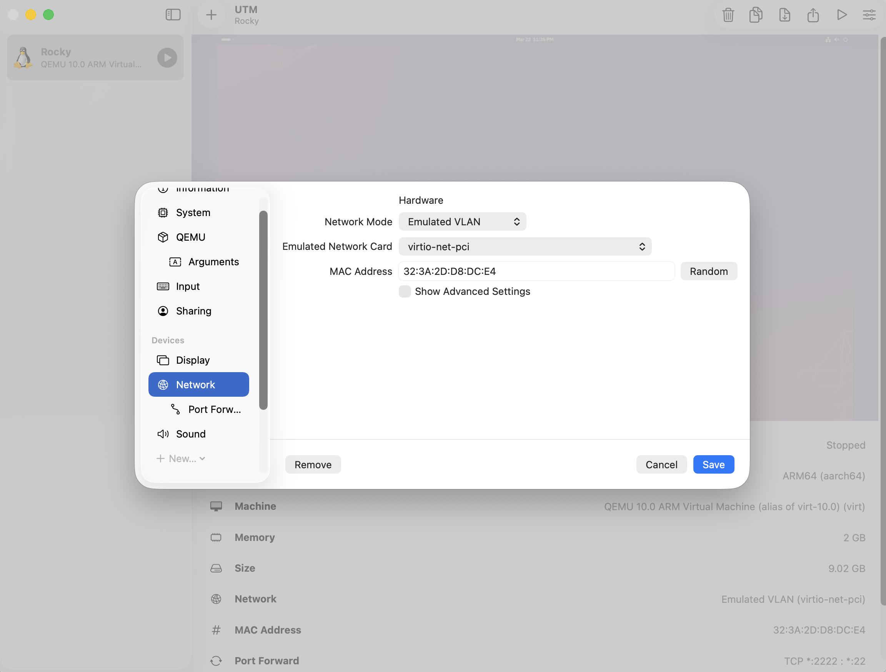
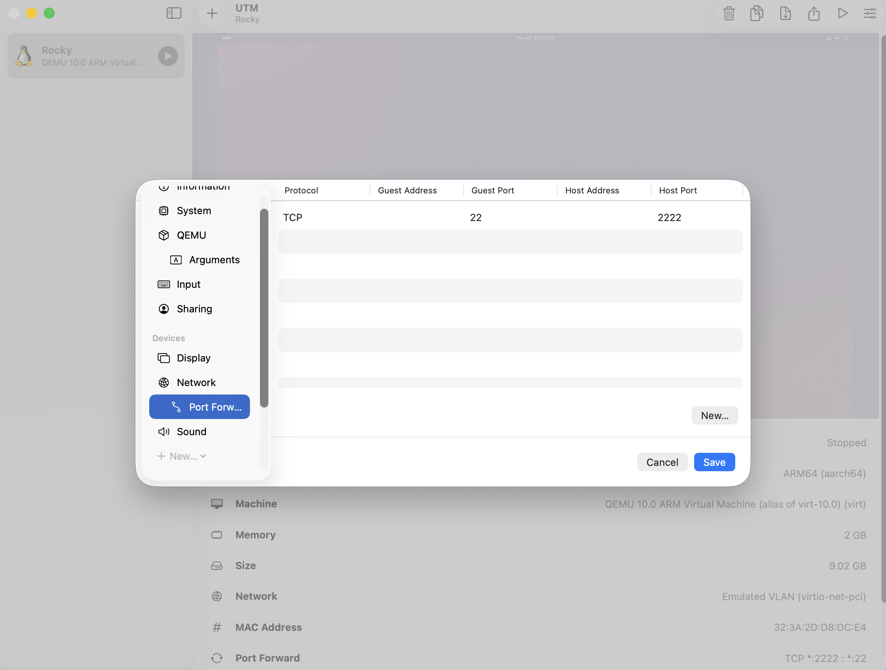

# Week1. RHEL 소개 및 기초

> RHEL의 개요와 엔터프라이즈 리눅스 생태계 이해, 설치 후 기본 환경 설정, 디렉터리 구조와 파일 탐색, 기본 명령어(ls, cd, pwd, cp, mv, rm) 실습, 도움말(man, --help) 활용

## `alias`
기본적으로 rocky linux에 설정된 alias들은 아래와 같다.
```
byeonggyu@localhost:~> alias
alias egrep='grep -E --color=auto'
alias fgrep='grep -F --color=auto'
alias grep='grep --color=auto'
alias l.='ls -d .* --color=auto'
alias ll='ls -l --color=auto'
alias ls='ls --color=auto'
alias which='(alias; declare -f) | /usr/bin/which --tty-only --read-alias --read-functions --show-tilde --show-dot'
alias xzegrep='xzegrep --color=auto'
alias xzfgrep='xzfgrep --color=auto'
alias xzgrep='xzgrep --color=auto'
alias zegrep='zegrep --color=auto'
alias zfgrep='zfgrep --color=auto'
alias zgrep='zgrep --color=auto'
```

## `ls`
List의 약자로, 현재 디렉토리의 파일 목록을 볼 수 있다.

```
byeonggyu@localhost:~> ls
Desktop  Documents  Downloads  Music  Pictures  Public  Templates  Videos

byeonggyu@localhost:~> ll
total 0
drwxr-xr-x. 2 byeonggyu byeonggyu 6 Mar 21 01:57 Desktop
drwxr-xr-x. 2 byeonggyu byeonggyu 6 Mar 21 01:57 Documents
drwxr-xr-x. 2 byeonggyu byeonggyu 6 Mar 21 01:57 Downloads
drwxr-xr-x. 2 byeonggyu byeonggyu 6 Mar 21 01:57 Music
drwxr-xr-x. 2 byeonggyu byeonggyu 6 Mar 21 01:57 Pictures
drwxr-xr-x. 2 byeonggyu byeonggyu 6 Mar 21 01:57 Public
drwxr-xr-x. 2 byeonggyu byeonggyu 6 Mar 21 01:57 Templates
drwxr-xr-x. 2 byeonggyu byeonggyu 6 Mar 21 01:57 Videos
```

## `pwd`
Print Working Directory의 약자로, 현재 내가 있는 경로를 출력한다.

```
byeonggyu@localhost:~> pwd
/home/byeonggyu
```

## `cd`
Change Directory의 약자로, 디렉토리를 이동한다.

```
byeonggyu@localhost:~> pwd
/home/byeonggyu
byeonggyu@localhost:~> cd Desktop
byeonggyu@localhost:~/Desktop> pwd
/home/byeonggyu/Desktop
```

## `cp`
Copy의 약자로, 파일/디렉토리를 복사한다.

```
byeonggyu@localhost:~> mkdir example
byeonggyu@localhost:~> ls
Desktop  Documents  Downloads  example  Music  Pictures  Public  Templates  Videos

byeonggyu@localhost:~> cp ./example/ ./Desktop/
cp: -r not specified; omitting directory './example/'
byeonggyu@localhost:~> cp -r example ./Desktop
byeonggyu@localhost:~> cd Desktop/
byeonggyu@localhost:~/Desktop> ls
example
```
`/home/byeonggyu`에 `example` 디렉토리를 생성한 뒤, `/home/byeonggyu/Desktop`으로 복사하는 과정이다.  
디렉토리이기 때문에 `-r`가 붙어야한다.

## `mv`
Move의 약자로, 파일/디렉토리를 이동하거나 이름을 변경할 수 있다.

### 이동 예시
```
byeonggyu@localhost:~/Desktop> ls
example
byeonggyu@localhost:~/Desktop> mv example ../
byeonggyu@localhost:~/Desktop> cd ..
byeonggyu@localhost:~> ls
Desktop  Documents  Downloads  example  Music  Pictures  Public  Templates  Videos
byeonggyu@localhost:~>
```
`/home/byeonggyu/Desktop`에 `example` 디렉토리를 생성한 뒤, `/home/byeonggyu`으로 이동하는 과정이다. 

### 이름 변경 예시
```
byeonggyu@localhost:~/Desktop> ls
example
byeonggyu@localhost:~/Desktop> mv example changed-example
byeonggyu@localhost:~/Desktop> ls
changed-example
```

## `rm`
Remove의 약자로, 파일/디렉토리를 삭제한다.

```
byeonggyu@localhost:~> ls
Desktop  Documents  Downloads  example  Music  Pictures  Public  Templates  Videos
byeonggyu@localhost:~> rm -rf example
byeonggyu@localhost:~> ls
Desktop  Documents  Downloads  Music  Pictures  Public  Templates  Videos
```

## `man`
Manual 페이지로, 명령어에 대한 상세한 매뉴얼을 보여준다.
`man <명령어>`로 확인할 수 있고, https://man7.org/linux/man-pages/dir_all_alphabetic.html 웹페이지에서도 같은 정보를 볼 수 있다.

```
byeonggyu@localhost:~> man grep

GREP(1)                                                                                                                      User Commands                                                                                                                      GREP(1)

NAME
       grep - print lines that match patterns

SYNOPSIS
       grep [OPTION...] PATTERNS [FILE...]
       grep [OPTION...] -e PATTERNS ... [FILE...]
       grep [OPTION...] -f PATTERN_FILE ... [FILE...]

DESCRIPTION
       grep searches for PATTERNS in each FILE.  PATTERNS is one or more patterns separated by newline characters, and grep prints each line that matches a pattern.  Typically PATTERNS should be quoted when grep is used in a shell command.

       A FILE of “-” stands for standard input.  If no FILE is given, recursive searches examine the working directory, and nonrecursive searches read standard input.
.
.
.
```
https://man7.org/linux/man-pages/man1/grep.1.html 에서도 똑같이 볼 수 있다.

## UTM VM을 Host SSH로 접속
UTM VM을 Host Terminal에 ssh로 접속할 수 있다.  
두 머신 간에 복사/붙여넣기 설정이 복잡할 경우, UTM 창과 번갈아가며 보기 불편할 경우 이로 해결할 수 있다.  

먼저, UTM에서 오른쪽 위 설정 버튼을 클릭한다(VM이 Stop된 상태에서만 활성화된다).  
다음으로, Network Mode를 `Emulated VLAN`으로 설정한다. 그러면 Port Forwarding 사이드바가 등장한다.  



New에서 Guest Port=22, Host Port=2222로 설정한다.  



이제 Host Terminal에서 `ssh -p 2222 byeonggyu@127.0.0.1`를 통해 VM에 접속할 수 있다.

``` text
❯ ssh -p 2222 byeonggyu@127.0.0.1
byeonggyu@127.0.0.1's password:
Web console: https://localhost:9090/ or https://10.0.2.15:9090/

Last login: Sun Mar 22 23:31:05 2026 from 10.0.2.2
byeonggyu@localhost:~> ls
Desktop  Documents  Downloads  Music  Pictures  Public  Templates  Videos
```

** 접속하기 위해서는 당연하게도 VM이 Running인 상태여야 한다.  
** rocky linux의 경우 위의 과정만 필요했는데, redhat linux는 추가적인 설정들이 필요할 수 있다.
