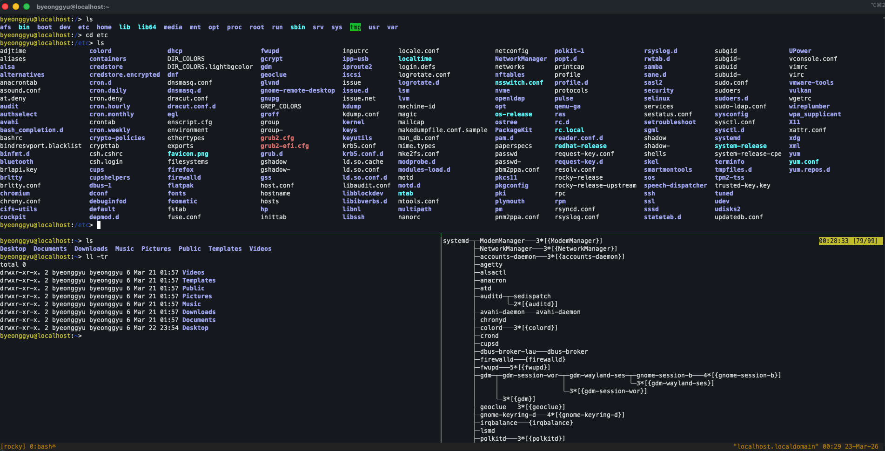

# Week2. 패키지 및 사용자 관리

> DNF와 RPM의 개념 및 차이 이해, 패키지 설치·업데이트·삭제 실습, Repository 구조와 설정 확인, 사용자 및 그룹 생성·변경·삭제, 파일 권한과 소유권 관리(chmod, chown, chgrp)

## RPM(RedHat Package Manager)과 RPM(Dandified YUM)
RHEL 계열 리눅스에서 새로운 패키지를 설치할 때, `dnf` 또는 `yum`으로 설치한다.  

- RPM은 `.rpm` 확장자의 로컬 패키지 파일을 설치하는 도구로, 의존성 해결 기능이 없다. 즉, 다른 필요한 파일이 없을 시 설치가 중단된다.
    - 실행 파일, 설정 파일, 라이브러리를 .rpm이라는 하나의 압축파일로 묶음
    - A를 설치하고 싶은데 B가 필요하고, B를 설치하는데 C가 필요한 등의 문제를 의존성 문제라 지칭
- DNF는 RPM의 상위 버전으로, 의존성 문제를 자동으로 해결해 설치한다.
    - 의존성이 걸린 모든 패키지를 한꺼번에 다운로드하여 순서대로 설치

### 패키지 설치 실습  
`dnf`를 통한 설치, `.rpm` 확장자 파일을 설치하는 것을 볼 수 있다.
```
byeonggyu@localhost:~> sudo dnf install -y tmux
Last metadata expiration check: 0:11:26 ago on Sun 22 Mar 2026 11:53:55 PM KST.
Dependencies resolved.
.
.
Downloading Packages:
tmux-3.3a-13.20250207gitb202a2f.el10.aarch64.rpm
.
.
Installed:
  tmux-3.3a-13.20250207gitb202a2f.el10.aarch64

Complete!
```

설치된 패키지 정보 확인
```
byeonggyu@localhost:~> rpm -qi tmux
Name        : tmux
Version     : 3.3a
Release     : 13.20250207gitb202a2f.el10
Architecture: aarch64
Install Date: Mon 23 Mar 2026 12:05:23 AM KST
Group       : Unspecified
Size        : 1204897
License     : ISC AND BSD-2-Clause AND BSD-3-Clause AND SSH-short AND LicenseRef-Fedora-Public-Domain
Signature   :
              RSA/SHA256, Wed 21 May 2025 01:58:33 PM KST, Key ID 5b106c736fedfc85
Source RPM  : tmux-3.3a-13.20250207gitb202a2f.el10.src.rpm
Build Date  : Fri 16 May 2025 02:31:46 PM KST
Build Host  : ord1-prod-a64build005.svc.aws.rockylinux.org
Packager    : Rocky Linux Build System <releng@rockylinux.org>
Vendor      : Rocky Enterprise Software Foundation
URL         : https://tmux.github.io/
Bug URL     : https://bugs.rockylinux.org
Summary     : A terminal multiplexer
Description :
tmux is a "terminal multiplexer."  It enables a number of terminals (or
windows) to be accessed and controlled from a single terminal.  tmux is
intended to be a simple, modern, BSD-licensed alternative to programs such
as GNU Screen.
```
패키지 업데이트 확인 및 실행
```
byeonggyu@localhost:~> sudo dnf check-update
Last metadata expiration check: 0:20:23 ago on Sun 22 Mar 2026 11:53:55 PM KST.
```
```
byeonggyu@localhost:~> sudo dnf update -y tmux
Last metadata expiration check: 0:20:32 ago on Sun 22 Mar 2026 11:53:55 PM KST.
Dependencies resolved.
Nothing to do.
Complete!
```
패키지 삭제
```
byeonggyu@localhost:~> sudo dnf remove -y tmux
Dependencies resolved.
.
.
.
Removed:
  tmux-3.3a-13.20250207gitb202a2f.el10.aarch64

Complete!
```

## Repository 구조와 설정 확인
Repository는 프로그램을 위한 코드들만 모여있는 것이 아니라, dnf가 잘 읽을 수 있도록 하는 Metadata도 포함되어 있다.  

### Repository에 포함된 정보들
- Packages: 실제 rpm 설치 파일들
- Metadata
    - primary.xml: 각 패키지가 어떤 파일을 포함하는지에 대한 정보
    - filelists.xml: 특정 파일이 어떤 패키지에 포함되는지에 대한 정보
    - other.xml: 변경 이력(changelog) 등 정보
    - comps.xml: 패키지 그룹 정보

### DNF의 동작 과정
우리가 `dnf install`로 설치할 때 우선 Repository 서버에서 Metadata를 `/var/cache/dnf`로 가져와 로컬 데이터베이스를 구축한다.  
그 후, 컴퓨터 안에서 의존성을 계산해 필요한 파일들을 요청한다.

### Repository 구조 실습

현재 활성화된 Repository 목록
```
byeonggyu@localhost:~> dnf repolist
repo id                                                                                                       repo name
appstream                                                                                                     Rocky Linux 10 - AppStream
baseos                                                                                                        Rocky Linux 10 - BaseOS
extras                                                                                                        Rocky Linux 10 - Extras
```

Repository 설정 파일들
```
byeonggyu@localhost:~> cat /etc/yum.repos.d/rocky.repo
# rocky.repo
#
# The mirrorlist system uses the connecting IP address of the client and the
# update status of each mirror to pick current mirrors that are geographically
# close to the client.  You should use this for Rocky updates unless you are
# manually picking other mirrors.
#
# If the mirrorlist does not work for you, you can try the commented out
# baseurl line instead.

[baseos]
name=Rocky Linux $releasever - BaseOS
mirrorlist=https://mirrors.rockylinux.org/mirrorlist?arch=$basearch&repo=BaseOS-$releasever$rltype
#baseurl=http://dl.rockylinux.org/$contentdir/$releasever/BaseOS/$basearch/os/
gpgcheck=1
enabled=1
countme=1
metadata_expire=6h
gpgkey=file:///etc/pki/rpm-gpg/RPM-GPG-KEY-Rocky-10
.
.
.
```

## 사용자 및 그룹 관리

리눅스는 다중 사용자 시스템으로 설계되었다.
- UID (User ID): 시스템이 사용자를 식별하는 번호이다. root는 항상 0이다.
- Primary Group: 사용자가 생성될 때 기본적으로 속하는 그룹이다. (보통 사용자명과 동일한 이름으로 생성됨)
- Secondary Group: 추가로 소속될 수 있는 그룹이다. 예를 들어 developer 사용자가 docker 그룹에 속하면 도커 실행 권한을 얻게 된다.

### 사용자, 그룹 추가 및 권한 관리 실습
```
byeonggyu@localhost:~> sudo groupadd devteam
byeonggyu@localhost:~> sudo useradd -m -g devteam testuser
byeonggyu@localhost:~> sudo passwd testuser
New password:
Retype new password:
passwd: password updated successfully

byeonggyu@localhost:~> sudo usermod -c "Test User" testuser

byeonggyu@localhost:~> sudo userdel -r testuser
byeonggyu@localhost:~> sudo groupdel devteam
```

## 파일 권한 및 소유권 관리
`ls -l` 실행 시 나타나는 10자리의 문자열(e.g. `-rwxr-xr--`)은 시스템의 출입 통제 리스트이다.

### 권한의 세 가지 영역 (U / G / O)
- User (Owner): 파일을 만든 사람
- Group: 파일이 속한 그룹의 멤버들
- Others: 그 외의 모든 사람

### 권한의 종류 (r / w / x)  

#### 파일
- r: 내용 읽기 (cat, vi)
- w: 내용 수정/삭제
- x: 실행 파일로서 실행 가능 여부

#### 디렉토리
- r: 내부 파일 목록 보기 (ls)
- w: 내부 파일 생성/삭제
- x: 해당 디렉토리로 진입 가능 여부 (cd). r 권한이 있어도 x가 없으면 그 안으로 들어갈 수 없다.

### 권한 및 소유권 관리 실습

- `example.txt` 파일 생성 및 권한 확인
```
byeonggyu@localhost:~> touch example.txt
byeonggyu@localhost:~> ls
Desktop  Documents  Downloads  example.txt  Music  Pictures  Public  Templates  Videos
byeonggyu@localhost:~> ls -l example.txt
-rw-r--r--. 1 byeonggyu byeonggyu 0 Mar 23 01:12 example.tx
```

- 권한 변경 및 확인
```
byeonggyu@localhost:~> chmod 751 example.txt
byeonggyu@localhost:~> ls -l example.txt
-rwxr-x--x. 1 byeonggyu byeonggyu 0 Mar 23 01:12 example.txt

byeonggyu@localhost:~> chmod g+w example.txt
byeonggyu@localhost:~> ls -l example.txt
-rwxrwx--x. 1 byeonggyu byeonggyu 0 Mar 23 01:12 example.txt
```

- `chown`, `chgrp` 로 소유자 및 그룹 변경
```
byeonggyu@localhost:~> sudo chown root:root example.txt
byeonggyu@localhost:~> ls -l example.txt
-rwxrwx--x. 1 root root 0 Mar 23 01:12 example.txt
byeonggyu@localhost:~> vi example.txt

byeonggyu@localhost:~> sudo chgrp wheel example.txt
byeonggyu@localhost:~> ls -l example.txt
-rwxrwx--x. 1 root wheel 0 Mar 23 01:12 example.txt
```

## tmux (Terminal Multiplexer) 설정
### tmux를 사용하는 이유
- 세션 유지 (Persistence): SSH 연결이 끊어져도 서버에서 돌아가던 프로세스는 죽지 않는다. 다시 접속해서 attach하면 작업하던 상태 그대로 복구된다.
- 화면 분할 (Multiplexing): 하나의 터미널 창에서 여러 개의 쉘을 띄워 로그 확인, 코드 수정, DB 쿼리를 동시에 할 수 있다.
- 자유로운 레이아웃: 윈도우(탭)와 팬(분할 창)을 조합해 복잡한 작업 환경을 구조화할 수 있다.

### 계층 구조 이해하기
tmux는 Session > Window > Pane 순의 포함 관계를 가진다.
- Session: 특정 프로젝트 단위의 전체 작업 환경 (예: rocky-study)
- Window: 웹 브라우저의 '탭'과 같은 개념 (예: 1번 탭은 vim, 2번 탭은 logs)
- Pane: 하나의 윈도우 안에서 화면을 쪼갠 단위 (가로/세로 분할)

tmux를 설치한 후 Session을 만든다.
```
byeonggyu@localhost:~> sudo dnf install tmux
byeonggyu@localhost:~> tmux new -s rocky
```

### 필수 단축키 (Prefix: `ctrl + b` 입력 후 실행)  
Tip: 모든 tmux 단축키는 `ctrl + b`를 먼저 누르고 손을 뗀 뒤, 다음 키를 입력하는 방식이다.

- Pane (화면 분할) 관리
    - `%`: 세로 분할 (좌/우)
    - `"`: 가로 분할 (상/하)
    - `x`: 현재 팬 닫기
    - `o`: 다음 팬으로 포커스 이동 (또는 방향키 사용)
    - `z`: 현재 팬 최대화 / 최소화 (Zoom - 로그 볼 때 매우 유용!)
    - `space`: 다음 레이아웃으로 자동 정렬 변경

- Window (탭) 관리
    - `c`: 새 윈도우 생성 (Create)
    - `n`: 다음(Next) 윈도우로 이동
    - `p`: 이전(Previous) 윈도우로 이동
    - `0~9`: 숫자로 해당 윈도우 바로 이동
    - `,`: 현재 윈도우 이름 변경 (가독성 향상)

- Session (환경) 관리
    - `d`: 세션에서 빠져나오기 (Detach - 프로세스는 계속 실행됨)
    - `s`: 전체 세션 목록을 보고 선택 이동

아래처럼 rocky session에 들어갈 수 있고, `ctrl+b -> command` 조합으로 pane 분할, window 추가 등을 쉽게 할 수 있다.  



- `.tmux.conf` : tmux 설정파일
```
byeonggyu@localhost:~> vi ~/.tmux.conf
# --- 기본 설정 ---
# 256 색상 지원
set -g default-terminal "screen-256color"
# 히스토리 용량 확장 (기본값은 보통 적음)
set -g history-limit 10000
# 마우스 모드 활성화 (클릭으로 팬 선택, 스크롤 가능)
set -g mouse on

# --- UI/디자인 ---
# 상태바 배경색과 글자색
set -g status-bg colour235
set -g status-fg colour136
# 활성화된 팬의 테두리 색상 강조 (현재 어디 있는지 식별 용이)
set -g pane-active-border-style fg=colour136,bg=default

# --- 편의 기능 ---
# 설정 파일 수정 후 바로 반영하는 단축키 (Prefix + r)
bind r source-file ~/.tmux.conf \; display "Reloaded!"

# 인덱스 번호를 1번부터 시작 (키보드 0번은 멀기 때문)
set -g base-index 1
setw -g pane-base-index 1
```
이렇게 설정할 경우 마우스로 pane 선택, 스크롤, 복사/붙여넣기(블록 선택 후 c로 복사)할 수 있다.
