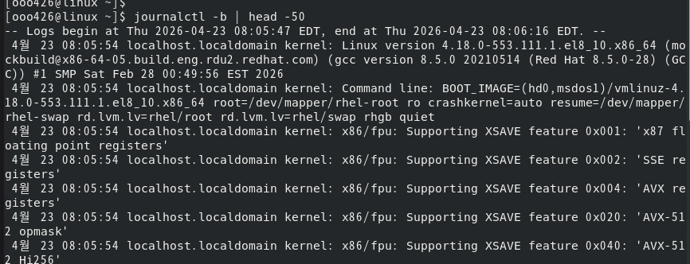
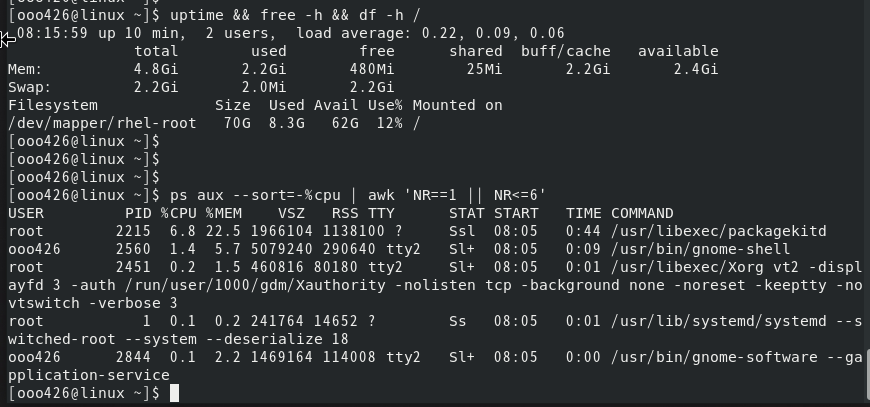
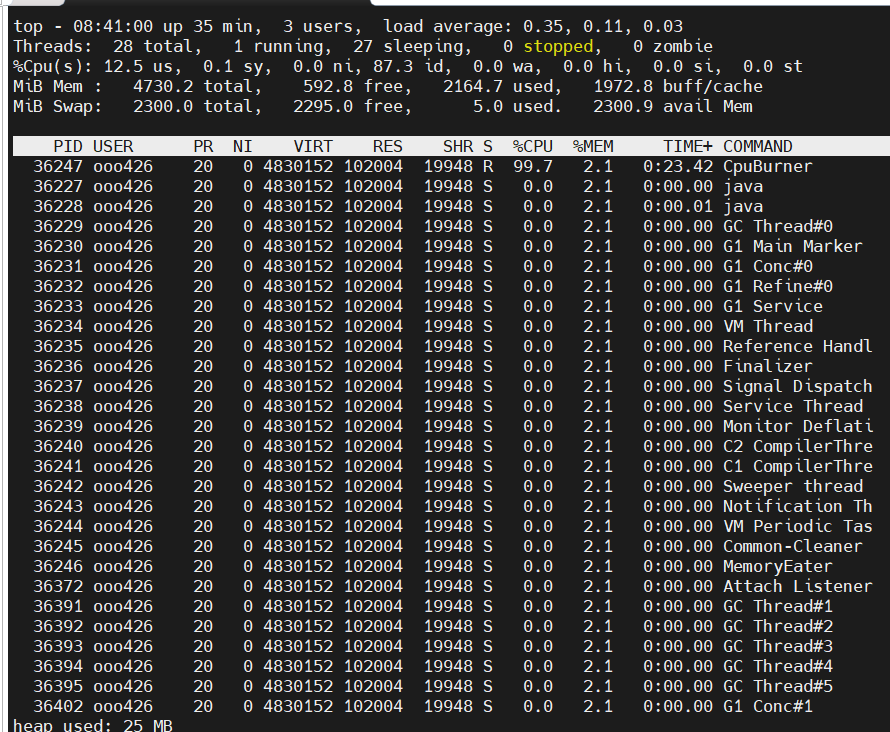

# Week 7. 로그 관리 및 시스템 모니터링

## 1. 이번 주 학습 주제

- 리눅스 로그의 역할과 주요 로그 파일 구조 이해
- `journalctl`을 활용한 시스템 로그 조회와 필터링
- 서비스 장애 분석을 위한 로그 추적 방법
- CPU·메모리·디스크·프로세스 사용량 점검 도구
- 시스템 성능 측정과 하드웨어 리소스 확인 도구 활용

## 2. 실습 환경

- Host OS: Windows 11
- Virtualization: Hyper-V
- Guest OS: RHEL 8 (Red Hat Enterprise Linux 8) GUI 설치
- 사용자 계정: `ooo426`

---

# Part 1. 로그 관리

## 3. 핵심 개념 정리

### 3-1. 로그 시스템의 두 축: rsyslog와 systemd-journald

리눅스에는 오랜 시간에 걸쳐 만들어진 **두 개의 로그 수집 체계**가 있다. 배포판마다 어느 쪽을 "주인공"으로 두느냐가 다른데, 이 구조를 모르면 "같은 이벤트를 두 군데서 찾는" 혼란이 생긴다.

| 구분 | rsyslog (전통 방식) | systemd-journald (현대 방식) |
|------|---------------------|------------------------------|
| **등장 시기** | 1980년대 syslog → 2004년 rsyslog | 2011년 systemd와 함께 |
| **저장 위치** | `/var/log/messages`, `/var/log/secure` 등 **텍스트 파일** | `/run/log/journal/` (tmpfs) 또는 `/var/log/journal/` **바이너리** |
| **형식** | 텍스트 | 바이너리 + 구조화 메타데이터 (JSON 변환 가능) |
| **조회 도구** | `cat`, `grep`, `less`, `tail` | `journalctl` |
| **필터링** | 텍스트 매칭 | 서비스/시간/PID/우선순위로 **구조화 질의** |
| **기본 지속성** | 영속 | 배포판에 따라 휘발 or 영속 |
| **원격 전송** | 네트워크 전송에 강함 (TCP/TLS, RELP) | 기본은 로컬, `systemd-journal-remote` 별도 |

#### 배포판별로 어떻게 쓰는가

systemd를 쓰는 주요 배포판은 **모두 journald가 기본 탑재**된다. 차이는 **rsyslog를 함께 돌리느냐**, **journald만으로 끝내느냐** 이다.

| 배포판 | journald | rsyslog | 동작 방식 |
|--------|----------|---------|-----------|
| **RHEL 7/8/9, Rocky, CentOS Stream** | 기본 | **기본 설치** | journald → rsyslog로 forward → `/var/log/messages` 생성 |
| **Fedora** (최신) | 기본 | **기본 제거됨** | journald 단독. `journalctl`로만 조회 |
| **Ubuntu 18.04 ~ 현재** | 기본 | 기본 설치(LTS) / 선택(Server 최신) | 둘 다 씀. 20.04부터 rsyslog 비중 축소 추세 |
| **Debian 10+** | 기본 | 기본 설치 | RHEL과 유사하게 둘 다 씀 |
| **Arch, openSUSE Tumbleweed** | 기본 | 기본 미설치 | journald 단독 |
| **Alpine** (musl) | 없음 | `busybox syslogd` 또는 rsyslog | systemd 자체가 없음 → syslog 계열만 사용 |

**핵심 요점**:
- **"RHEL 계열 = rsyslog + journald 공존"**: 익숙한 `/var/log/messages`가 여전히 생긴다
- **"Fedora/Arch = journald 단독"**: `/var/log/messages`가 없다. `journalctl`이 유일한 창구
- **"Ubuntu는 과도기"**: 버전에 따라 다르므로 `systemctl status rsyslog`로 실제 설치 여부를 먼저 확인

#### 두 시스템이 공존할 때의 데이터 흐름

```
 애플리케이션 ── syslog() / stderr ──▶ systemd-journald
                                             │
                          ┌──────────────────┤
                          ▼                  ▼
                 /run/log/journal/     imjournal (rsyslog 입력 모듈)
                 (journalctl로 조회)           │
                                              ▼
                                     /var/log/messages
                                     /var/log/secure
                                     /var/log/cron ...
```

RHEL 계열에서는 rsyslog 설정 파일(`/etc/rsyslog.conf`)에 `module(load="imjournal")`이 기본으로 들어있어서 **journald가 받은 로그를 rsyslog가 다시 긁어다가 텍스트 파일로 쓴다**. 그래서 같은 이벤트를 `journalctl`로도 `/var/log/messages`로도 볼 수 있다.

#### 그럼 실무에서는 뭘 쓰나

- **단일 서버 디버깅**: `journalctl -u <서비스>` 가 압도적으로 편하다 (구조화 질의)
- **중앙 로그 서버로 전송**: 여전히 rsyslog가 유리 (TCP/TLS forwarding이 성숙)
- **컨테이너/쿠버네티스**: journald도 rsyslog도 아닌 **stdout/stderr → 컨테이너 런타임 → Fluentd/Loki** 흐름이 표준

### 3-2. 주요 로그 파일 구조 (`/var/log`)

```bash
ls -l /var/log
```

| 파일 | 내용 |
|------|------|
| `/var/log/messages` | 일반 시스템 메시지 (커널 제외 대부분) |
| `/var/log/secure` | 인증 관련 (ssh 로그인, sudo 사용, PAM) |
| `/var/log/cron` | cron 실행 기록 |
| `/var/log/maillog` | 메일 서버 로그 |
| `/var/log/boot.log` | 부팅 과정 로그 |
| `/var/log/dmesg` | 커널 메시지 (부팅 시점) |
| `/var/log/audit/audit.log` | auditd (SELinux/감사 정책) |
| `/var/log/httpd/`, `/var/log/nginx/` | 웹 서버 애플리케이션 로그 |

> 애플리케이션 로그(Tomcat, Spring, MySQL 등)는 보통 `/var/log/<앱이름>/` 또는 앱 설치 경로 밑에 따로 쌓는다. 시스템 로그와는 구분된다.

#### 로그 로테이션(logrotate)

로그 파일이 무한정 커지지 않도록 **logrotate**가 주기적으로 파일을 잘라서 압축/삭제한다. 설정은 `/etc/logrotate.conf`와 `/etc/logrotate.d/*`에 있다.

```bash
# 로테이션 설정 확인
cat /etc/logrotate.conf

# 강제로 로테이션 실행 (테스트)
sudo logrotate -f /etc/logrotate.conf
```

결과물은 `messages-20260423`, `messages.1.gz` 같은 형태로 남는다.

### 3-3. journalctl 실전 사용법

`journalctl`은 systemd-journald의 로그를 질의하는 명령어다. 텍스트 `grep`보다 **구조화된 필터**를 쓸 수 있어서 훨씬 강력하다.

```bash
# 전체 로그 (가장 오래된 것부터)
journalctl

# 이번 부팅 이후의 로그만
journalctl -b

# 이전 부팅의 로그 (예: 재부팅 전 장애 분석)
journalctl -b -1

# 최신 로그부터 역순
journalctl -r

# 실시간 tail (tail -f 느낌)
journalctl -f

# 특정 서비스(유닛)의 로그
journalctl -u sshd
journalctl -u httpd.service

# 시간 범위로 자르기
journalctl --since "2026-04-23 09:00" --until "2026-04-23 10:00"
journalctl --since "1 hour ago"
journalctl --since yesterday

# 우선순위 필터 (err 이상만)
journalctl -p err

# 커널 메시지만
journalctl -k

# 특정 프로세스(PID) 기준
journalctl _PID=1234
```

#### 복합 조건

조건은 서로 **AND**로 결합된다. 예를 들어 "어젯밤 sshd 서비스에서 에러만" 보려면:

```bash
journalctl -u sshd -p err --since yesterday
```

#### 디스크 사용량과 영속화

journald는 기본적으로 `/run/log/journal/`(tmpfs)에 쌓여 재부팅 시 사라진다. 영속화하려면:

```bash
# 로그 저장소 크기 확인
journalctl --disk-usage

# 영속 저장 설정
sudo mkdir -p /var/log/journal
sudo systemctl restart systemd-journald

# 크기 제한 정리 (1GB 이상은 지움)
sudo journalctl --vacuum-size=1G

# 2주 이전 로그 정리
sudo journalctl --vacuum-time=2weeks
```

### 3-4. 로그 레벨(Severity)

syslog/journald는 **8단계 우선순위**를 쓴다. 숫자가 작을수록 치명적이다.

| 숫자 | 이름 | 의미 | 상황 예 |
|------|------|------|---------|
| 0 | emerg | 시스템 사용 불가 | 커널 패닉 |
| 1 | alert | 즉시 조치 필요 | DB 손상 감지 |
| 2 | crit | 치명적 오류 | 하드웨어 고장 |
| 3 | err | 일반 에러 | 서비스 시작 실패 |
| 4 | warning | 경고 | 디스크 80% 도달 |
| 5 | notice | 주목할 정상 상태 | 서비스 재시작 완료 |
| 6 | info | 일반 정보 | 요청 처리 로그 |
| 7 | debug | 디버그 정보 | 상세 트레이스 |

`journalctl -p 3` 은 "err 이상(0~3)만 보여 달라"는 뜻이다.

## 4. 실습: journalctl로 로그 분석

```bash
# 1) 시스템 부팅 관련 로그만
journalctl -b | head -50

# 2) sshd 로그에서 로그인 실패 찾기
sudo journalctl -u sshd | grep -i "failed"

# 3) 최근 1시간 내 에러 이상 메시지
journalctl --since "1 hour ago" -p err

# 4) 실시간으로 httpd 로그 보기 (Ctrl+C로 종료)
sudo journalctl -u httpd -f

# 5) 특정 PID가 남긴 로그만 추적
journalctl _PID=1

# 6) JSON으로 덤프 → jq로 파싱
journalctl -u sshd -o json --since "today" | jq '.MESSAGE' | head
```

시스템 부팅 관련 로그 확인


---

# Part 2. 시스템 자원 모니터링

## 5. 핵심 개념 정리

### 5-1. Load Average와 CPU

**Load Average**는 최근 1분/5분/15분 동안 **실행 대기 상태였던 프로세스의 평균 개수**이다. CPU 수와 비교해서 해석한다.

```bash
uptime
# 14:32:11 up 3 days,  2:14,  1 user,  load average: 0.85, 0.92, 0.77
```

- CPU 4코어 기준: load 0.85 → 여유 있음, load 4.00 → 포화, load 8.00 → 심각한 대기
- **3개 숫자의 추세**가 중요: `5, 3, 1` 이면 "지금 갑자기 부하가 몰렸다", `1, 3, 5` 이면 "몰렸다가 가라앉는 중"

> load는 CPU뿐 아니라 **I/O 대기(D state)** 도 포함한다. CPU는 놀고 있는데 load가 높다면 디스크 I/O를 의심해야 한다.

### 5-2. top, htop - 실시간 프로세스 모니터링

```bash
top
```

```
top - 14:32:11 up 3 days,  load average: 0.85, 0.92, 0.77
Tasks: 185 total,   1 running, 184 sleeping
%Cpu(s):  3.2 us,  1.1 sy,  0.0 ni, 95.5 id,  0.2 wa
MiB Mem :   7977.5 total,   2134.2 free,   3210.8 used,   2632.5 buff/cache
MiB Swap:   2048.0 total,   2048.0 free,      0.0 used.

  PID USER      PR  NI    VIRT    RES    SHR S  %CPU  %MEM   TIME+ COMMAND
 1234 ooo426    20   0 4823456 512344  23456 S  15.3   6.3  12:45.67 java
```

| 항목 | 의미 |
|------|------|
| `us` | 사용자 프로세스 CPU 사용률 |
| `sy` | 커널(시스템 호출) CPU 사용률 |
| `id` | 유휴(idle) |
| `wa` | I/O 대기 (wait) — 높으면 디스크/네트워크 병목 |
| `%CPU` | 프로세스별 CPU 점유율 (코어 1개 기준 100%) |
| `%MEM` | 전체 메모리 중 이 프로세스가 쓰는 비율 |
| `VIRT` | 가상 메모리 사용량 (예약까지 포함) |
| `RES` | 실제 물리 메모리 사용량 (**진짜 중요한 값**) |

#### top 대화형 키

| 키 | 동작 |
|----|------|
| `P` | CPU 사용률 순 정렬 |
| `M` | 메모리 사용률 순 정렬 |
| `1` | 코어별 CPU 보기/숨기기 |
| `c` | 전체 커맨드 라인 보기 |
| `k` | PID 입력해서 프로세스 kill |
| `q` | 종료 |

`htop`은 top의 컬러·마우스 지원판이다 (별도 설치 필요: `sudo dnf install htop`).

### 5-3. 메모리 - free, vmstat

```bash
free -h
#               total        used        free      shared  buff/cache   available
# Mem:          7.8Gi       3.1Gi       2.1Gi        45Mi       2.6Gi       4.3Gi
# Swap:         2.0Gi          0B       2.0Gi
```

**오해 포인트**: `free`가 낮다고 "메모리 부족"이 아니다. 리눅스는 남는 메모리를 **buff/cache**로 쓴다. 진짜 중요한 값은 **available**이다.

- `available`: 새 프로세스가 쓸 수 있는 실질 여유 메모리
- `buff/cache`: 필요하면 즉시 회수 가능한 캐시
- **Swap > 0**: 물리 메모리가 부족해 디스크로 내려갔다는 신호 — 성능 저하 원인

```bash
# 실시간 메모리·CPU·I/O 변화 (2초 간격)
vmstat 2
```

| 컬럼 | 의미 |
|------|------|
| `r` | 실행 대기 중인 프로세스 수 |
| `b` | 중단 불가 대기(주로 I/O) 프로세스 수 |
| `si`, `so` | Swap In/Out — **0이 아니면 적신호** |
| `us`, `sy`, `id`, `wa` | CPU 사용률 분포 |

### 5-4. 디스크 - df, du, iostat

```bash
# 파일시스템별 용량
df -h
# Filesystem      Size  Used Avail Use% Mounted on
# /dev/mapper/rl-root  50G   32G   18G  64% /
# /dev/sda1           1.0G  250M  775M  25% /boot

# 인코드(inode) 사용률 — 파일 개수 한계
df -i

# 디렉토리별 크기
du -sh /var/log/*
du -sh /var/log/* | sort -h | tail -10
```

> "디스크는 남는데 파일이 안 써진다?" → `df -i` 로 inode를 확인. 작은 파일이 수백만 개라서 inode가 먼저 고갈된 경우가 꽤 있다.

```bash
# I/O 성능 통계 (sysstat 패키지 필요: sudo dnf install sysstat)
iostat -xz 2
```

| 컬럼 | 의미 |
|------|------|
| `r/s`, `w/s` | 초당 읽기/쓰기 횟수 |
| `rkB/s`, `wkB/s` | 초당 읽기/쓰기 용량 |
| `%util` | 디스크 사용률 — 100%에 가까우면 포화 |
| `await` | I/O 요청 평균 대기 시간 (ms) |

### 5-5. 프로세스 - ps, pidstat

```bash
# 전체 프로세스
ps -ef

# 메모리 순 정렬 상위 10개
ps aux --sort=-%mem | head

# CPU 순 정렬 상위 10개
ps aux --sort=-%cpu | head

# 특정 프로세스 트리
ps -ef --forest | grep -A5 systemd

# 한 프로세스의 자원 사용 추이
pidstat -p <PID> 1 5   # 1초 간격 5회
```

## 6. 실습: 자원 사용량 점검

```bash
# 1) 현재 load, CPU, 메모리 스냅샷 한 번에
uptime && free -h && df -h /

# 2) CPU를 많이 먹는 프로세스 상위 5개
ps aux --sort=-%cpu | awk 'NR==1 || NR<=6'

# 3) /var 밑에서 가장 큰 디렉토리
sudo du -sh /var/* 2>/dev/null | sort -h | tail

# 4) 디스크 I/O가 몰리는 순간 포착
iostat -xz 1

# 5) 메모리 압박 체크 (si, so가 0이 아니면 스왑 발생)
vmstat 2 5
```


`uptime`으로 load average 확인, `free -h`로 실제 available 메모리 점검, `df -h`로 디스크 사용률, `ps aux --sort=-%cpu`로 CPU 상위 프로세스(`packagekitd`, `gnome-shell` 등)까지 한 번에 파악.

---

# Part 3. 하드웨어 리소스 점검 + 장애 분석

## 7. 핵심 개념 정리

### 7-1. 하드웨어 정보 수집

```bash
# CPU 상세 정보 (모델, 코어 수, 캐시, 플래그)
lscpu

# 메모리 슬롯 상세
sudo lsmem
sudo dmidecode -t memory   # DIMM 단위 상세

# 블록 장치(디스크) 트리
lsblk
lsblk -f    # 파일시스템 타입까지

# PCI 장치 (네트워크 카드, GPU 등)
lspci
lspci | grep -i ethernet

# USB 장치
lsusb

# 전체 하드웨어 요약
sudo lshw -short
```

### 7-2. 커널 메시지와 dmesg

`dmesg`는 커널 **링 버퍼**를 보여준다. 하드웨어 이벤트, 드라이버 메시지, **OOM Killer**, 디스크 에러 등 저수준 문제의 흔적이 여기에 먼저 남는다.

```bash
# 최근 커널 메시지 (사람이 읽기 좋은 타임스탬프)
sudo dmesg -T | tail -50

# OOM Killer 발동 여부
sudo dmesg -T | grep -i "killed process"

# 디스크 I/O 에러
sudo dmesg -T | grep -iE "error|fail"

# USB가 안 잡힐 때 꽂으면서 보기
sudo dmesg -wT
```

### 7-3. sar로 과거 기록 분석

`top`, `vmstat`은 **지금 이 순간**만 본다. 그런데 장애는 보통 "새벽 3시"에 터지고, 출근해서 보면 이미 끝난 상태다. `sar`는 **과거를 돌려보기** 위해 존재한다.

```bash
# 설치 (RHEL/CentOS)
sudo dnf install sysstat
sudo systemctl enable --now sysstat

# CPU 사용률 이력
sar -u

# 메모리 사용률 이력
sar -r

# 디스크 I/O 이력
sar -b

# 네트워크 이력
sar -n DEV

# 특정 날짜(예: 15일)의 기록
sar -u -f /var/log/sa/sa15

# 시간 범위 지정
sar -u -s 03:00:00 -e 04:00:00 -f /var/log/sa/sa15
```

sar는 기본적으로 10분 간격으로 스냅샷을 떠 `/var/log/sa/`에 저장한다. "새벽 3시에 CPU 몇 % 였나?" 라는 질문에 바로 답할 수 있다.

## 8. 실무 사례: 서비스 장애 원인 추적 플로우

운영 중인 서비스가 죽었을 때, 로그와 모니터링 도구를 **어떤 순서**로 봐야 할까? 막상 장애가 나면 당황해서 순서를 잃는데, 이 흐름을 한 번 정리해두면 침착해진다.

### 8-1. 5분 안에 돌리는 점검 루틴

```bash
# ① 서비스 상태 — 지금 살아있나, 왜 죽었나 요약
systemctl status my-service

# ② 서비스 로그 — 죽기 직전 stderr
sudo journalctl -u my-service -n 100 --no-pager

# ③ 커널 메시지 — OOM Killer에게 당했나?
sudo dmesg -T | grep -iE "killed process|out of memory" | tail

# ④ 현재 시스템 부하
uptime && free -h && df -h

# ⑤ 자원 도둑 찾기
ps aux --sort=-%mem | head
ps aux --sort=-%cpu | head

# ⑥ 과거 추이 (죽은 시간대 자원 상태)
sar -r -s 02:50:00 -e 03:10:00   # 장애 시각 ±10분
```

### 8-2. 시나리오: "Spring 서비스가 새벽 3시에 죽었다"

```
┌─────────────────────────────────────────────────────────────┐
│ 1. journalctl -u spring-app --since "03:00" --until "03:10" │
│    → Java stack trace 확인                                  │
│    → "java.lang.OutOfMemoryError" 발견?                     │
└─────────────────────────────────────────────────────────────┘
                           │
            ┌──────────────┴──────────────┐
            ▼                             ▼
   ┌────────────────┐            ┌─────────────────┐
   │ 앱 내부 OOM     │            │ 앱 내부 로그 조용 │
   │ (JVM heap 고갈)│            │ (OS가 kill했나?)│
   └────────┬───────┘            └────────┬────────┘
            ▼                             ▼
   heap dump 분석               dmesg -T | grep -i kill
   JVM 옵션 재검토               → OOM Killer가 java 프로세스 종료
   (Xmx, GC 로그)                 → sar -r 로 그 시각 메모리 확인
                                  → 다른 프로세스가 메모리 먹었나?
```

### 8-3. 자주 쓰는 조합 치트시트

| 증상 | 첫 번째 확인 명령 |
|------|-------------------|
| 서비스가 자꾸 재시작됨 | `systemctl status X` → `journalctl -u X --since today` |
| 시스템이 느려짐 | `uptime` → `top` → `iostat -xz 2` |
| 디스크가 꽉 찼다고 함 | `df -h` → `du -sh /var/* \| sort -h` |
| 메모리가 부족함 | `free -h` → `ps aux --sort=-%mem \| head` → `dmesg \| grep -i oom` |
| SSH 접속 실패가 잦음 | `sudo journalctl -u sshd -p err --since yesterday` |
| 네트워크가 이상함 | `ss -tulnp` → `sar -n DEV` → `dmesg \| grep -iE "link\|eth"` |
| 부팅 후 서비스 안 뜸 | `journalctl -b -u X` → `systemctl list-units --failed` |

### 8-4. 실습: 장애 현장에서 증거 남기기 (10분 미니 실습)

장애가 나면 1차 본능은 **"일단 재시작"** 이지만, 재시작하는 순간 메모리 안의 증거가 전부 사라진다. 아래 순서대로 VM에서 직접 돌려보면서 **"재시작 전에 뭘 떠야 하는가"** 를 몸에 익힌다.

#### ① 사전 준비 — 실습용 자바 프로세스 띄우기 (1분)

```bash
# JDK가 없다면 설치
sudo dnf install -y java-17-openjdk-devel

# 일부러 "멈춘 척 하는" 자바 프로세스 생성
cat > /tmp/Stuck.java <<'EOF'
public class Stuck {
  public static void main(String[] a) throws Exception {
    while (true) Thread.sleep(1000);
  }
}
EOF
cd /tmp && javac Stuck.java && java Stuck &
```

#### ② PID 찾기 (30초)

```bash
# 자바 프로세스 목록
jps -l
# 예: 3421 Stuck

# 변수로 잡아두면 이후 명령이 편하다
PID=$(pgrep -f Stuck)
echo $PID
```

#### ③ 스레드 덤프 — "지금 뭐하는 중?" (2분)

```bash
# jstack으로 스레드 상태 저장
jstack $PID > /tmp/thread.txt
head -30 /tmp/thread.txt

# 스레드별 CPU 사용률 보기
top -H -p $PID      # q로 종료
```


`CpuBurner` 스레드가 혼자 **99.7% CPU**를 먹고 있는 게 보인다. 그 아래 `MemoryEater`, `GC Thread#0~5`, `G1 Service` 등 JVM 내부 스레드도 모두 드러난다. 하단의 `heap used: 25 MB` 출력은 `MemoryEater`가 1초마다 1MB씩 쌓고 있다는 증거.

> 운영 팁: 똑같은 걸 **5초 간격으로 3번** 뜬다. 같은 스레드가 같은 위치에 멈춰있으면 그게 범인.

#### ④ 힙 덤프 — "누가 메모리를 먹는가?" (2분)

```bash
# jcmd로 힙 덤프 (권장)
jcmd $PID GC.heap_dump /tmp/heap.hprof

# 파일 생성 확인
ls -lh /tmp/heap.hprof
```

> `.hprof` 파일은 나중에 **Eclipse MAT** / **VisualVM**으로 열어 분석. 실제로 열어보는 것까지는 오늘 생략.
> **주의**: 힙 덤프 뜨는 동안 JVM은 멈춘다(STW). 운영 서버에선 주의.

#### ⑤ 프로세스가 뭘 열고 있는지 (1분)

```bash
# 열린 파일·소켓·라이브러리
sudo lsof -p $PID | head -10

# 지금 어떤 시스템 콜에서 대기 중인가 (Ctrl+C로 종료)
sudo strace -p $PID -tt
```

#### ⑥ 증거 폴더 한 방에 만들기 (2분)

```bash
# 장애 시점 증거를 한 디렉토리에 모아두면 나중에 분석이 편하다
DIR=/tmp/incident-$(date +%H%M) && mkdir -p $DIR && cd $DIR

uptime               > state.txt
free -h             >> state.txt
df -h               >> state.txt
ps auxf             >> state.txt
jstack $PID          > thread.txt
jcmd $PID GC.heap_dump $PWD/heap.hprof
sudo dmesg -T        > dmesg.log
sudo journalctl -b   > journal.log

ls -lh
```

#### ⑦ 정리 (30초)

```bash
# 실습용 프로세스 종료
kill $PID
# (혹은) 수집한 증거 폴더 확인 후 삭제
ls /tmp/incident-*
```

**이번 실습으로 얻는 감각**:
- `jps / jstack / jcmd`가 JDK에 기본 내장이라 **추가 설치 없이** 바로 쓸 수 있다
- 재시작 전 **몇 분의 투자**로 사후 분석이 가능해진다
- `$DIR`에 모으는 스크립트는 팀에 공유해두면 온콜(on-call) 대응 SOP가 된다

---

## 9. 전체 구조 요약

```
시스템 관측(Observability) 스택
├─ 로그(Log)
│   ├─ rsyslog  → /var/log/messages, /var/log/secure
│   ├─ journald → journalctl (-u, -b, -p, -f, --since)
│   └─ 애플리케이션 로그 → /var/log/<app>/, 앱 설치 경로
│
├─ 자원(Resource) — 실시간
│   ├─ CPU/Load → uptime, top, htop
│   ├─ 메모리   → free, vmstat
│   ├─ 디스크   → df, du, iostat
│   └─ 프로세스 → ps, pidstat
│
├─ 하드웨어(Hardware)
│   ├─ 구성 정보 → lscpu, lsmem, lsblk, lspci, lsusb, lshw
│   └─ 커널 이벤트 → dmesg (OOM, 디스크 에러, 장치 인식)
│
└─ 과거 기록(History)
    └─ sar → /var/log/sa/ — 시점 지정 분석

장애 대응 플로우
  status → journalctl → dmesg → free/df → ps → sar
     └──── "지금" ────┘   └──── "그때" ────┘
```

---

## 10. 참고 자료

- [Red Hat - Configuring basic system settings: Reviewing log files](https://docs.redhat.com/en/documentation/red_hat_enterprise_linux/8/html/configuring_basic_system_settings/reviewing-log-files_configuring-basic-system-settings)
- [systemd-journald man page](https://www.freedesktop.org/software/systemd/man/systemd-journald.service.html)
- [journalctl man page](https://www.freedesktop.org/software/systemd/man/journalctl.html)
- [Red Hat - Monitoring and managing system status and performance](https://docs.redhat.com/en/documentation/red_hat_enterprise_linux/8/html/monitoring_and_managing_system_status_and_performance/)
- [sysstat (sar, iostat, pidstat) 공식 문서](https://sysstat.github.io/)
