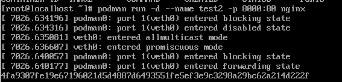
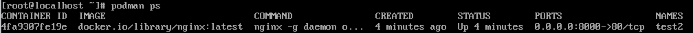
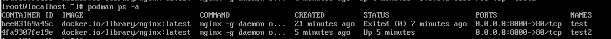
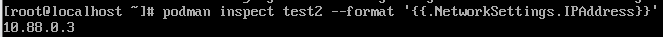
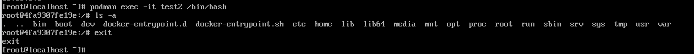
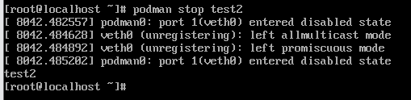
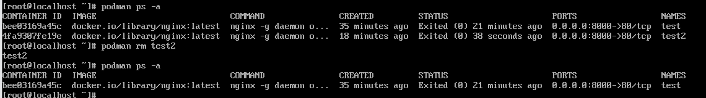

# 컨테이너 실행·중지·접속 실습

## 컨테이너 실행

### 주요 명령어
``` bash
$ podman run [옵션][이미지]
```


### 자주 사용하는 옵션
- `-d` : 백그라운드에서 실행
- -`-name` : 컨테이너에 이름을 부여
- `-p [Host_Port][Container_Port]` : 포트포워딩
- `-v [Host_Path][Continaer_Path]:Z` : 볼륨 마운트
- `-it` : 터미널 입력이 필요한 경우 사용

## 컨테이너 상태 확인

### 주요 명령어
``` bash
$ podman ps
```



``` bash
$ podman inspect [이름]
```


### 자주 사용하는 옵션
- `-a` : 종료된 컨테이너까지 포함하여 이력 조회
- `--format` : 특정 정보만 골라 보고 싶을 때 사용

## 컨테이너 접속 및 실행

### 주요 명령어
``` bash
$ podman exec [옵션][이릠][명령어]
```


## 중지 및 삭제

### 주요 명령어

``` bash
$ podman stop [이름]
```


``` bash
$ podman kill [이름]
```

``` bash
$ podman rm [이름]
```


### 자주 사용하는 옵션
- `-f` : 실행 중인 컨테이너를 한 번에 중지하고 삭제
- `-a` : 모든 컨테이너 삭제 
